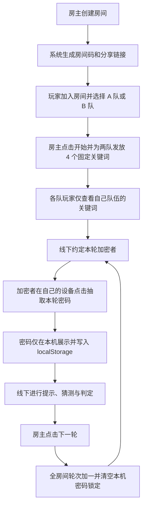

## 1. 产品概述
为《截码战 / 谍报风云》提供一个极简网页发牌工具，只负责建房、分组、发固定关键词和本地随机抽取密码，不承担裁判、计分或记录职责。
- 目标用户是线下聚会中想用手机替代实体桌游组件的玩家，尤其适合熟人局、默认不作弊的使用场景。
- 产品价值在于把“保密发词”和“每轮私密看密码”数字化，同时保持当前仓库的静态 HTML 技术路线，降低维护和部署成本。

## 2. 核心功能

### 2.1 用户角色
| 角色 | 进入方式 | 核心权限 |
|------|----------|----------|
| 房主 | 创建房间 | 生成房间、发放两队关键词、重开本局、进入下一轮 |
| A 队玩家 | 通过房间码或链接加入并选择 A 队 | 查看 A 队固定 4 词，在自己设备本地抽取本轮密码 |
| B 队玩家 | 通过房间码或链接加入并选择 B 队 | 查看 B 队固定 4 词，在自己设备本地抽取本轮密码 |

### 2.2 功能模块
1. **房间入口模块**：创建房间、输入房间码加入、分享短码或链接。
2. **队伍分组模块**：玩家进入房间后选择 A 队或 B 队，并登记昵称。
3. **固定关键词模块**：房主开局后，系统为 A/B 两队各随机生成 4 个固定关键词并同步到各自队员页面。
4. **本地抽密码模块**：玩家在自己的设备上点击按钮，基于当前轮次本地生成并锁定一个三位数字密码。
5. **轮次控制模块**：房主点击下一轮后，全房间轮次递增；每位玩家设备本地的密码锁定状态清空，允许重新抽取。
6. **整局重开模块**：房主重新发放两队 4 个词，并把轮次重置为第 1 轮。

### 2.3 页面细节
| 页面名称 | 模块名称 | 功能描述 |
|-----------|-------------|---------------------|
| 截码战主页 | 房间入口 | 展示玩法简介、创建房间、输入房间码加入房间 |
| 截码战主页 | 房间状态 | 显示房间码、当前轮次、已加入玩家与分组状态 |
| 截码战主页 | 队伍选择 | 玩家加入后选择 A 队或 B 队并填写昵称 |
| 截码战主页 | 队伍词板 | 仅显示当前玩家所属队伍的 4 个固定关键词 |
| 截码战主页 | 本地密码面板 | 点击按钮后仅在本设备展示本轮密码，并在本轮内锁定 |
| 截码战主页 | 房主控制条 | 开局发词、下一轮、重开本局、复制分享链接 |

## 3. 核心流程
房主进入页面创建房间，系统生成房间码和分享链接。其他玩家通过短码或链接进入后，选择自己所属的 A 队或 B 队。房主点击开始后，系统为 A/B 两队各发 4 个固定关键词并同步给对应队伍成员。每轮由线下约定的加密者在自己的手机上点击“抽取本轮密码”，密码仅在当前设备展示并使用 `localStorage` 锁定，直到房主进入下一轮后才允许重新抽取。整局的讨论、猜测、胜负判断都在线下进行，网页只承担发牌与轮次辅助作用。

## 4. 用户界面设计
### 4.1 设计风格
- 主色调：深色谍报风界面，使用墨绿、黑灰、琥珀色作为主辅色。
- 按钮风格：硬朗圆角矩形按钮，带细边框和微弱发光效果，强调“终端控制台”氛围。
- 字体与字号：标题使用有机械感的展示字体，正文使用清晰的无衬线字体，保证手机端可读性。
- 布局风格：单页多状态布局，上方是房间与轮次状态，中间是队伍与词板，下方是密码抽取与房主控制区。
- 图标与符号建议：使用简洁的终端、信号、密码、频道等轻谍报元素，不使用卡通化视觉。

### 4.2 页面设计概览
| 页面名称 | 模块名称 | UI 元素 |
|-----------|-------------|-------------|
| 截码战主页 | 房间入口 | 高对比输入框、分享按钮、状态胶囊、轻微入场动画 |
| 截码战主页 | 队伍词板 | 四格词板、编号标签、私密区域高亮、仅对当前队伍可见 |
| 截码战主页 | 本地密码面板 | 大号数字展示、遮罩/显隐按钮、已锁定状态提示 |
| 截码战主页 | 房主控制条 | 轮次切换按钮、重开发牌按钮、操作确认提示 |

### 4.3 响应式设计
- 采用移动端优先设计，兼容桌面端横向展示。
- 手机端保证单手操作，核心按钮固定在易点击区域。
- 密码展示区支持大字号和高对比，方便多人聚会时快速查看。
- 避免复杂弹窗层级，优先使用单页状态切换与卡片折叠。
