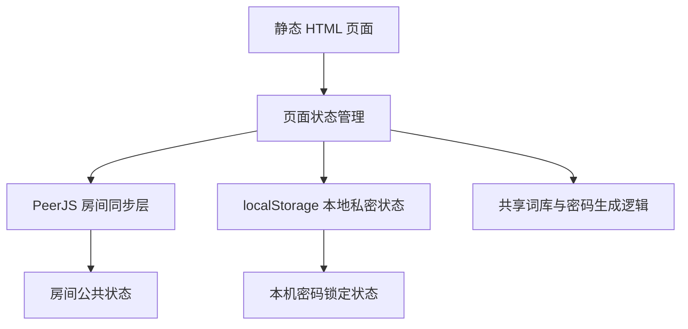
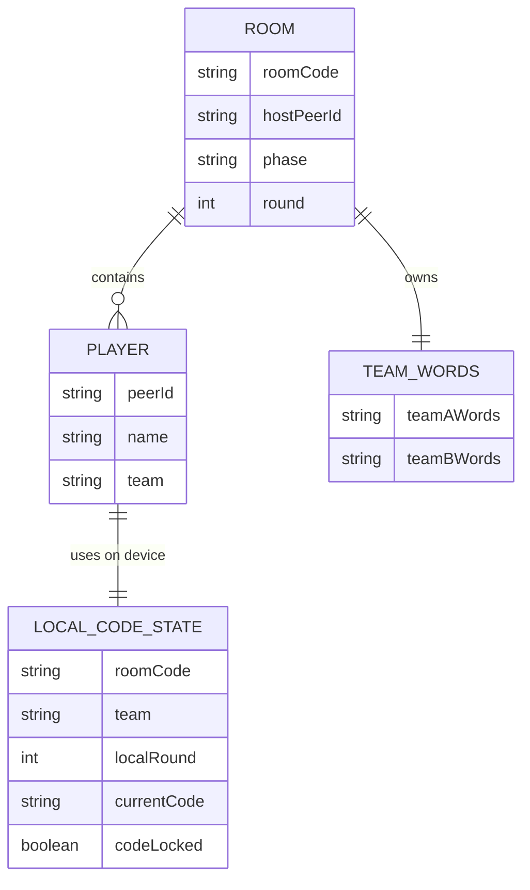

## 1. 架构设计


## 2. 技术说明
- 前端：原生 HTML + CSS + JavaScript
- 联机方式：PeerJS CDN，复用仓库现有 `codenames.html` 的无后端建房思路
- 状态同步：房主作为房间主节点，广播公共房间状态
- 本地存储：`localStorage` 保存当前设备所属队伍、昵称、本轮是否已抽密码、本轮密码内容
- 数据来源：新增 `decrypto_word_bank.js` 或内嵌词库常量，提供适合《截码战》的固定关键词池
- 构建方式：无构建、无编译，直接静态部署并通过 `python3 -m http.server` 预览

## 3. 路由定义
| 路由 | 用途 |
|-------|---------|
| `/decrypto.html` | 截码战极简联机发牌页 |
| `/index.html` | 首页导航入口，增加截码战入口 |

## 4. API 定义
本项目不引入后端 API，全部通信通过房主与玩家之间的 PeerJS 消息完成。

### 4.1 房间公共状态
```js
{
  roomCode: string,
  hostPeerId: string,
  phase: "lobby" | "running",
  round: number,
  teamWords: {
    A: string[],
    B: string[]
  },
  players: Array<{
    peerId: string,
    name: string,
    team: "A" | "B"
  }>
}
```

### 4.2 本机私密状态
```js
{
  roomCode: string,
  playerName: string,
  team: "A" | "B",
  localRound: number,
  currentCode: string | null,
  codeLocked: boolean
}
```

### 4.3 PeerJS 消息类型
```js
type Message =
  | { type: "join"; payload: { name: string; team: "A" | "B" } }
  | { type: "state_sync"; payload: RoomState }
  | { type: "start_game"; payload: { round: number; teamWords: { A: string[]; B: string[] } } }
  | { type: "next_round"; payload: { round: number } }
  | { type: "restart_game"; payload: { round: number; teamWords: { A: string[]; B: string[] } } };
```

## 5. 服务端架构图
本方案无独立服务端，不需要服务端分层架构。

## 6. 数据模型
### 6.1 数据模型定义


### 6.2 数据定义说明
- 不使用数据库和 DDL。
- 房间公共状态保存在房主内存中，并通过 PeerJS 广播。
- 玩家设备的本轮密码与锁定状态保存在 `localStorage`，键名建议带上 `roomCode + team + round`，避免不同房间相互覆盖。
- “真实密码”不进入公共同步状态，只存在于当前点击抽取密码的设备中。
